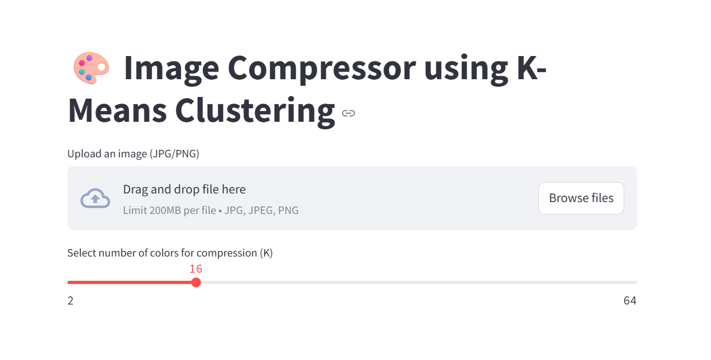
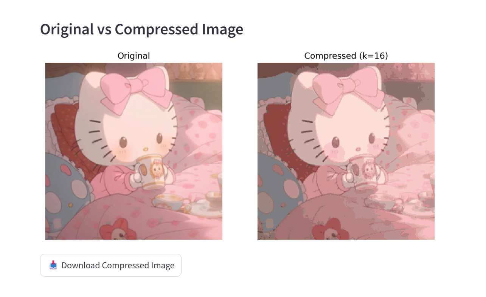

# 🎨 Image Compressor Web App using K-Means Clustering

This is a simple web app built with **Streamlit** that compresses uploaded images using **K-Means clustering** to reduce the number of colors. You can upload an image, choose how many colors to retain (K), preview the result, and download the compressed image.

---

## 🖼️ App Screenshots

### 🔹 Image Upload Screen

### 🔹 Compressed Image with Download Option

---

## 🚀 Features

- Upload JPEG/PNG images
- Compress using K-Means Clustering
- Adjust number of colors (K)
- Side-by-side preview
- Download compressed image
- Dark-themed interface

---

